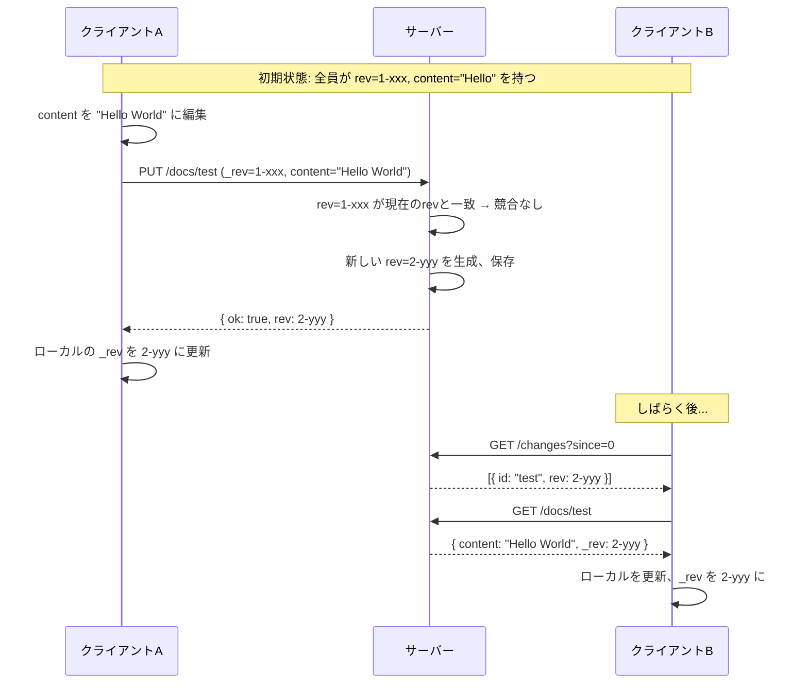
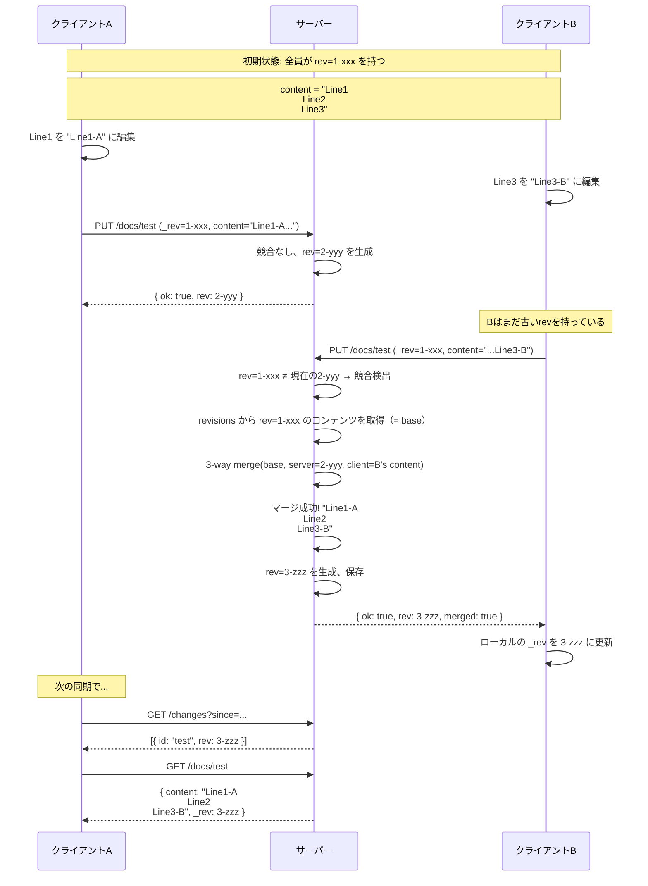
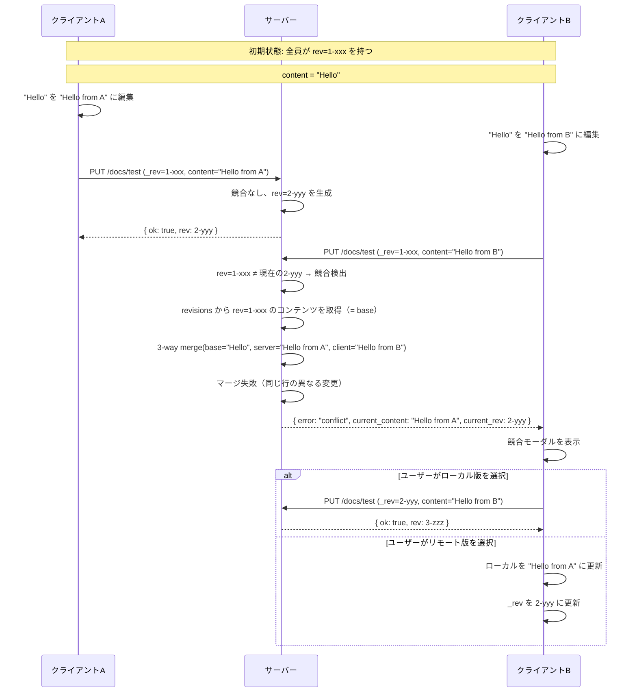
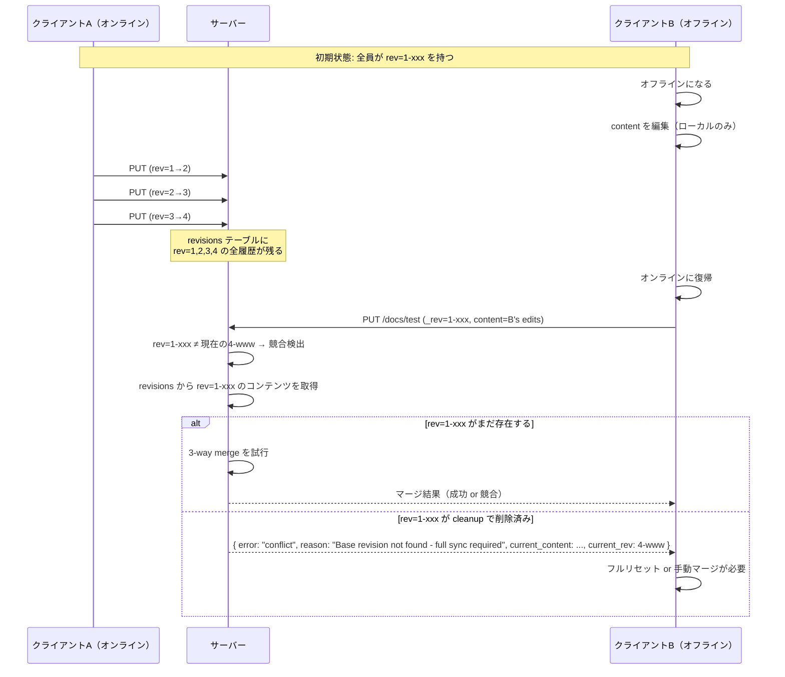
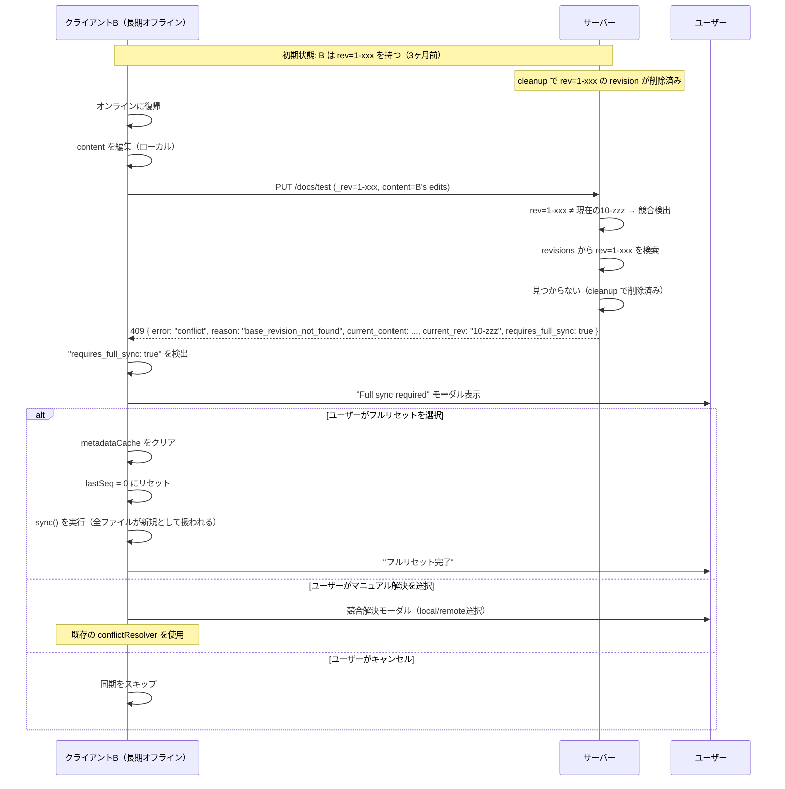
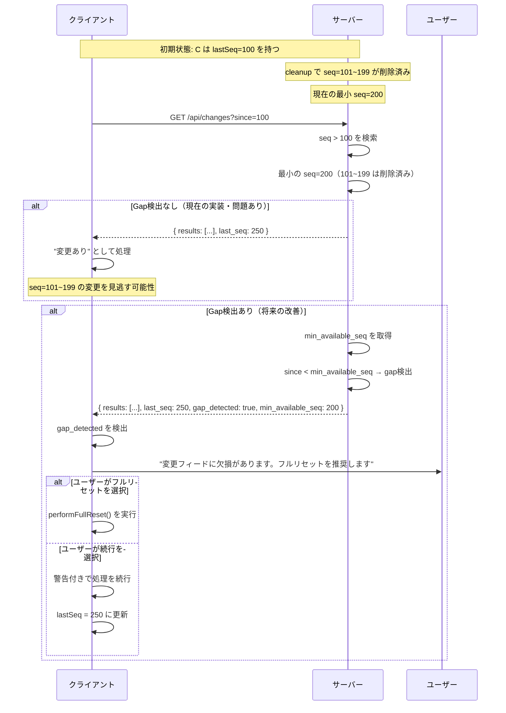
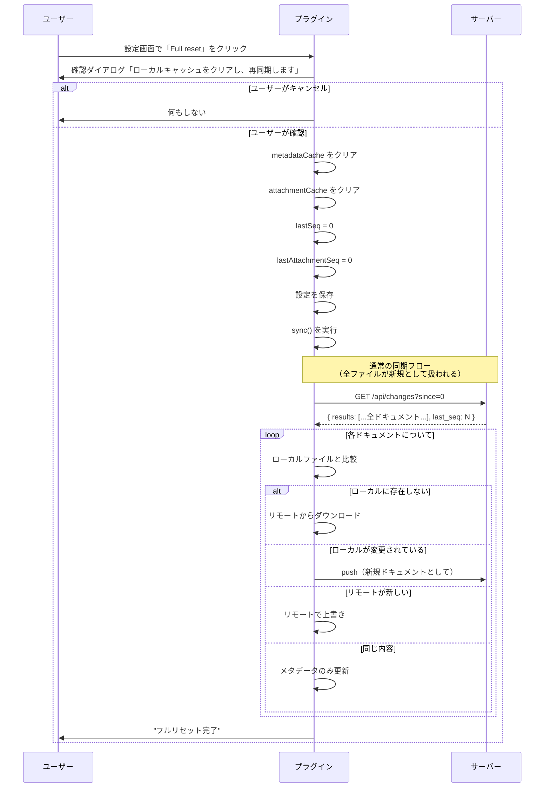
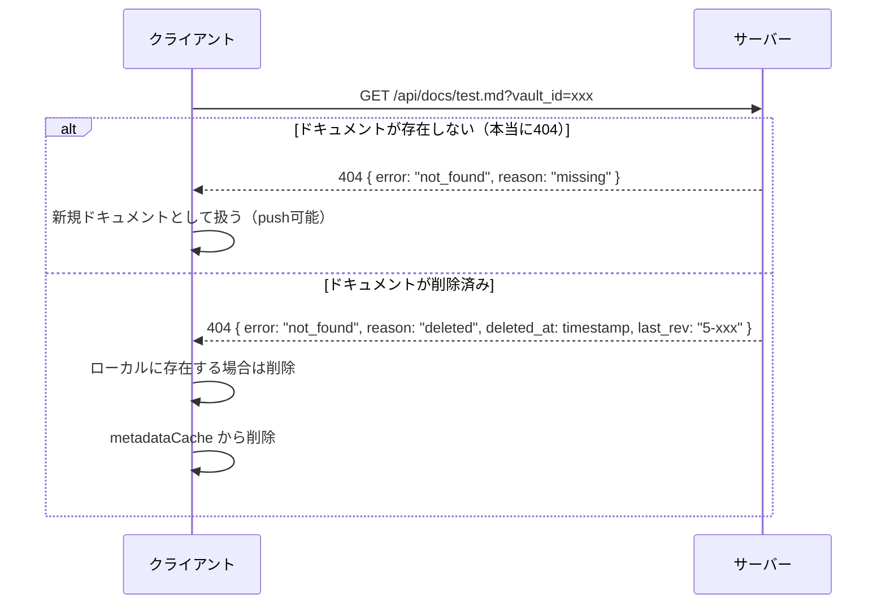
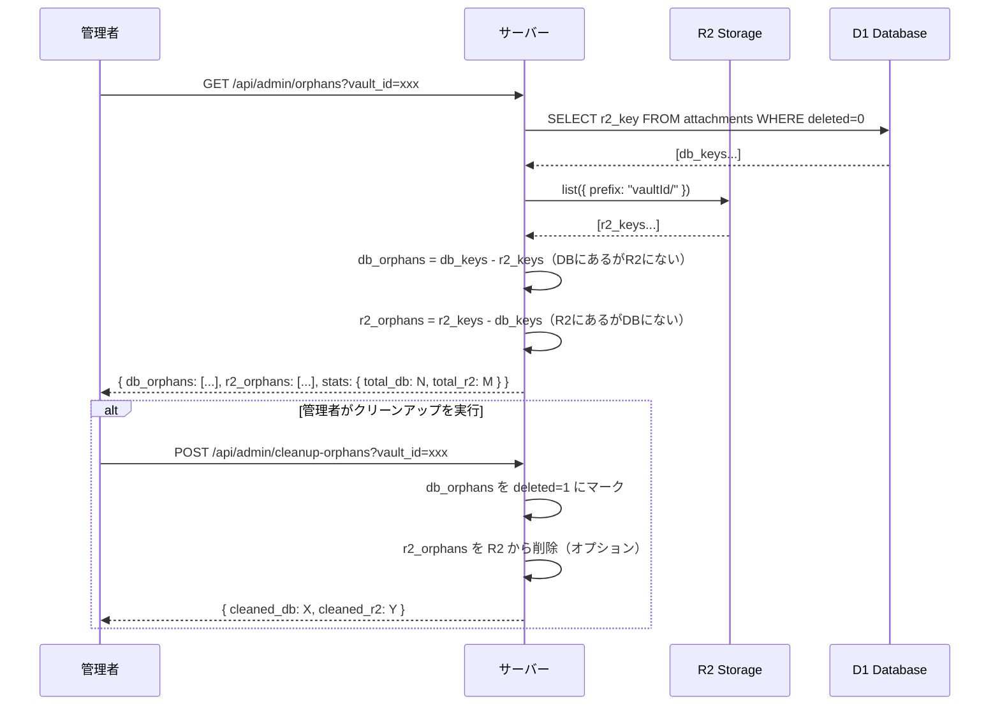

# Claude開発メモ

このファイルには、プロジェクトの開発に関する重要な情報と今後の課題をまとめています。

## プロジェクト概要

Obsidian同期システム（Cloudflare Workers + D1 + Obsidianプラグイン）のモノレポ。

### 技術スタック

- **ランタイム**: Bun (latest)
- **パッケージマネージャー**: Bun workspaces
- **サーバー**: Cloudflare Workers + D1 (SQLite) + R2 (Object Storage)
- **フレームワーク**: Elysia
- **プラグイン**: TypeScript + Obsidian API
- **CI/CD**: GitHub Actions

### モノレポ構造

```
packages/
├── server/          # Cloudflare Workersバックエンド
│   ├── src/
│   │   ├── index.ts         # Elysiaアプリ
│   │   ├── types.ts         # TypeScript型定義
│   │   ├── db/
│   │   │   ├── schema.sql   # D1スキーマ
│   │   │   └── queries.ts   # データベースクエリ
│   │   └── utils/
│   │       ├── revision.ts  # リビジョン管理
│   │       ├── auth.ts      # 認証ヘルパー
│   │       └── merge.ts     # 3-way mergeアルゴリズム
│   └── .dev.vars.example    # 環境変数テンプレート
└── plugin/          # Obsidianプラグイン
    └── src/
        ├── main.ts              # エントリーポイント
        ├── sync-service.ts      # 同期ロジック
        ├── document-sync.ts     # ドキュメント同期
        ├── attachment-sync.ts   # アタッチメント同期
        ├── settings.ts          # 設定UI
        ├── conflict-modal.ts    # 競合解決UI
        └── types.ts             # TypeScript型定義
```

## 開発フロー

### セットアップ

```bash
bun install
cd packages/server
bun run db:local
bun run dev
```

### ワークスペースコマンド

```bash
bun run dev:server        # サーバー開発
bun run dev:plugin        # プラグイン開発
bun run build:server      # サーバーデプロイ
bun run build:plugin      # プラグインビルド
```

### デプロイ

#### 初回デプロイ前の準備

⚠️ **重要**: 初回デプロイ前に、以下の手順でD1データベースをセットアップしてください：

1. **D1データベースの作成**
   ```bash
   cd packages/server
   wrangler d1 create obsidian-sync
   ```

2. **database_idの設定**
   - 上記コマンドの出力からdatabase_idをコピー
   - `packages/server/wrangler.jsonc` の `d1_databases[0].database_id` を実際の値に置き換え

3. **テーブルの作成**
   ```bash
   wrangler d1 execute obsidian-sync --file=./src/db/schema.sql
   ```

4. **R2バケットの作成（アタッチメント同期用）**
   ```bash
   wrangler r2 bucket create obsidian-attachments
   ```
   - `packages/server/wrangler.jsonc`にR2バインディングが設定済み

#### デプロイ方法

- **自動**: mainブランチへのpushで自動デプロイ（GitHub Actions）
- **手動**: `bun run deploy` (packages/server)

#### 必要なGitHub Secrets

- `CLOUDFLARE_API_TOKEN`: Workers編集権限を持つAPIトークン
- `CLOUDFLARE_ACCOUNT_ID`: CloudflareのアカウントID

## セキュリティ上の重要事項

### API認証

- APIキーは環境変数 `API_KEY` で設定（必須）
- 生成方法: `openssl rand -hex 32`
- APIキーは**必ずAuthorizationヘッダー**で送信
- クエリパラメータでの送信は禁止（ログに残る）
- `.dev.vars`ファイルは`.gitignore`に含まれている
- サーバーとプラグインで同じAPIキーを設定する

## 実装済み機能

### サーバー (packages/server)

- ✅ ドキュメントCRUD操作
- ✅ リビジョン管理と競合検出
- ✅ **3-way merge による自動競合解決**
- ✅ 変更フィード（増分同期）
- ✅ 論理削除
- ✅ 一括ドキュメント操作
- ✅ マルチVault対応
- ✅ **R2によるアタッチメント（画像・バイナリファイル）保存**
- ✅ **アタッチメント変更フィード**

### プラグイン (packages/plugin)

- ✅ 同期サービス（Pull/Push）
- ✅ **競合解決UI（local/remote選択）**
- ✅ **自動マージと手動解決の組み合わせ**
- ✅ メタデータキャッシュの永続化（baseContent含む）
- ✅ ローカル削除の同期
- ✅ フォルダ作成処理
- ✅ 自動同期（設定可能な間隔）
- ✅ 設定UI（URL検証付き）
- ✅ エラーハンドリング
- ✅ **アタッチメント同期（画像、PDF、音声、動画等）**
- ✅ **SHA-256ハッシュによる重複検出**

## 未実装機能・制限事項

以下の機能は現在実装されていません：

1. **WebSocketによるリアルタイム通知**
   - 現在はポーリングベースの同期
   - Cloudflare Durable Objectsの検討が必要

2. **エンドツーエンド暗号化**
   - サーバー側でコンテンツが平文
   - クライアント側での暗号化/復号化が必要

3. **CouchDBのview/query機能**
   - 複雑な検索・フィルタリング

4. **差分同期**
   - 現在はファイル全体を同期
   - 大きなファイルの効率的な同期のために必要

## 既知の課題

### プラグイン

1. **メタデータキャッシュのサイズ**
   - 大量のファイルでパフォーマンスに影響の可能性
   - 定期的なクリーンアップ機構が必要かも

2. **同期の粒度**
   - ファイル単位でしか同期できない
   - セクション単位の同期は未対応

3. **ネットワークエラーのリトライ**
   - 現在は単純にエラーを表示
   - 指数バックオフでのリトライ実装を検討

### サーバー

1. **D1のクエリ制限**
   - 1クエリあたり最大1000行
   - 大規模Vaultでの動作に注意

2. **レート制限**
   - 現在未実装
   - 悪意あるリクエストへの対策が必要

3. **認証機構**
   - APIキー認証は必須
   - OAuth等の本格的な認証は未実装

4. **3-way mergeの制限**
   - 行ベースのマージのため、同じ行内の競合は検出できない
   - 大きなファイルではパフォーマンスに影響の可能性

### データ設計・同期フロー（追加・優先度付き）

1. **[高][対応済み] マルチVaultのスキーマ整合性**
   - `documents` を `(id, vault_id)` 複合PK化
   - `revisions` に `vault_id` 追加、`(doc_id, vault_id)` で参照
   - `changes` は `vault_id` を維持

2. **[高] アタッチメントID/R2キーがパス非依存で衝突**
   - 実装は `vaultId:hash.ext` / `vaultId/hash.ext` のため、同一内容・同拡張子の別ファイルが上書きされる
   - 削除や再アップロードが他パスの添付にも影響し得る
   - 対策: 仕様と実装を統一（パス含有 or 完全な内容アドレス方式の明確化）

3. **[高] 仕様ドキュメントの齟齬（アタッチメントキー）**
   - ドキュメントでは R2キーに `filepath` を含む前提だが、実装は含まない
   - 対策: 仕様を修正するか実装を合わせる

4. **[中] 変更フィードのインデックス不足**
   - クエリは `vault_id` + `seq` で範囲取得だが複合インデックスがない
   - 大規模Vaultで遅延の恐れ

5. **[中] 変更フィードのクリーンアップと再同期戦略**
   - 変更履歴を削除すると長期未同期クライアントが追従不可になる
   - 対策: フルリセット/スナップショット同期の方針を明記

6. **[中] アタッチメントのデータフローが片方向**
   - クライアントはアップロード後にMarkdown参照をURLへ置換し、ローカル添付を削除
   - 他クライアントは添付をダウンロードせずURL参照のみになる
   - 対策: 期待挙動として明記、必要ならダウンロード同期を追加

7. **[中] R2とDB更新の一貫性**
   - R2 PUT後にDB更新のため、失敗時に孤児オブジェクトが残る可能性
   - 対策: 再試行/補償処理や定期クリーンアップを検討

8. **[低] アタッチメントContentの公開範囲**
   - `/api/attachments/:id/content` は認証不要でURLが推測されると閲覧可能
   - 対策: 署名付きURLや期限付きアクセスを検討（必要な場合のみ）

## 今後の開発方針

### 優先度: 高

1. **認証機構の強化**
   - 本番環境での利用を考慮
   - ユーザー単位のアクセス制御

2. **マルチVaultのスキーマ整合性修正（対応済み）**
   - `documents`/`revisions`/`changes` の整合を確保
   - `(id, vault_id)` 複合キーを前提に再設計

3. **アタッチメントID/R2キーの設計統一**
   - パス含有方式へ戻す/維持の意思決定
   - 既存データの移行方針を確定

4. **エラーハンドリングの改善**
   - ネットワークエラーのリトライ
   - より詳細なエラーメッセージ

5. **テストの追加**
   - サーバー側のユニットテスト
   - プラグインの統合テスト

### 優先度: 中

1. **パフォーマンス最適化**
   - 差分同期の実装
   - バッチ処理の最適化

2. **変更フィードの再同期戦略**
   - クリーンアップ後の復旧/フル同期方針を明記

3. **変更フィードのインデックス強化**
   - `vault_id` + `seq` の複合インデックスを検討

4. **監視・ログ機能**
   - Cloudflare Analyticsとの連携
   - エラーログの集約

### 優先度: 低

1. **WebSocketサポート**
   - リアルタイム同期（Durable Objects使用）

2. **E2E暗号化**
   - プライバシー保護の強化

## 開発時の注意点

### Bun Workspaces

- `--filter`フラグでワークスペースを指定
- `workspace:*`プロトコルでワークスペース間の依存を参照
- pnpm-workspace.yamlは不要（package.jsonのworkspacesを使用）

### GitHub Actions

- 最新バージョンを使用:
  - actions/checkout@v6
  - oven-sh/setup-bun@v2
  - cloudflare/wrangler-action@v3

### コミットメッセージ

- 変更の種類を明確に（feat, fix, docs, refactor等）
- セキュリティ関連は必ず明記

## 参考リンク

- [Bun Documentation](https://bun.sh/docs)
- [Cloudflare Workers](https://developers.cloudflare.com/workers/)
- [Cloudflare D1](https://developers.cloudflare.com/d1/)
- [Elysia Documentation](https://elysiajs.com/)
- [Obsidian Plugin Development](https://docs.obsidian.md/)

## 競合解決機能の詳細

### 3-way Merge アルゴリズム

サーバー側で実装された3-way mergeは、以下の3つのバージョンを比較します：

1. **Base**: 最後に同期した共通の祖先バージョン
2. **Local**: サーバー側の現在のバージョン
3. **Remote**: クライアントから送信された新しいバージョン

#### マージの動作

- **両方が同じ変更**: 自動的に受け入れる
- **片方だけが変更**: 変更を自動的に適用
- **異なる変更（競合）**: ユーザーに選択を促す

### 競合解決UI

競合が検出された場合、プラグインはモーダルを表示して以下の選択肢を提供します：

1. **ローカル版を使用**: ローカルの変更を優先してサーバーに強制プッシュ
2. **リモート版を使用**: サーバーの変更を受け入れてローカルを更新
3. **キャンセル**: 同期をスキップして、次回の同期まで保留

### 技術的な実装詳細

- `packages/server/src/utils/merge.ts`: 3-way mergeアルゴリズム
- `packages/plugin/src/conflict-modal.ts`: 競合解決UI
- `packages/plugin/src/sync-service.ts`: 競合ハンドリングロジック

### サーバー側 baseContent 管理（設計中）

従来はクライアント側でbaseContent（前回同期時のコンテンツ）をIndexedDBに保存していたが、モバイルでのIndexedDBの不安定さ（iOS Safariのバグ、WebView制限、バックグラウンドでのデータ消失）を回避するため、サーバー側でbaseContentを管理する方式に移行する。

#### 基本方針

- `revisions`テーブルにはすでに過去のコンテンツが保存されている
- クライアントは`_rev`（前回同期時のリビジョン）を送信
- サーバーは`_rev`に対応するコンテンツをbaseContentとして取得し、3-way mergeを実行
- クライアント側のbaseContent保存が不要になり、モバイルでも安定動作

#### シーケンス図

##### ケース1: 正常同期（競合なし）

クライアントAが編集→同期、その後クライアントBが同期。競合は発生しない。



##### ケース2: 競合あり・自動マージ成功

クライアントAとBが同時に異なる箇所を編集。サーバー側で3-way mergeが成功。



##### ケース3: 競合あり・手動解決必要

クライアントAとBが同じ行を編集。3-way mergeが失敗し、ユーザーに解決を促す。



##### ケース4: 長期オフライン後の同期

クライアントが長期間オフラインで、その間に他のクライアントが複数回更新。



##### ケース5: Base revision not found（フルリセット必要）

クライアントが長期オフラインで、base revisionがクリーンアップで削除済み。フルリセットが必要。



##### ケース6: 変更フィード途切れ（Gap検出）

サーバーでクリーンアップが実行され、クライアントが期待するseq範囲が欠損。



##### ケース7: フルリセット実行フロー

設定UIからフルリセットを実行するフロー。



##### ケース8: 404エラーの詳細処理

ドキュメント取得時の404を詳細に分類して処理。



##### ケース9: 孤児ファイル検出（管理者用）

DBとR2の整合性をチェックし、孤児ファイルを検出。



#### API変更点

現在の`PUT /api/docs/:id`リクエスト:
```json
{
  "_id": "test.md",
  "_rev": "1-xxx",
  "content": "new content",
  "_base_content": "old content"  // ← クライアントが送信（削除予定）
}
```

新しいリクエスト:
```json
{
  "_id": "test.md",
  "_rev": "1-xxx",
  "content": "new content"
  // _base_content は不要（サーバーが revisions から取得）
}
```

#### 実装タスク

1. **サーバー側**
   - [x] `revisions`テーブルから指定revのコンテンツを取得するクエリ追加
   - [x] 競合検出時に自動でbaseContentを取得してマージ
   - [x] baseが見つからない場合のエラーハンドリング

2. **クライアント側**
   - [x] `_base_content`の送信を削除
   - [x] IndexedDB依存を削除
   - [x] `base-content-store.ts`を削除

## アタッチメント同期機能の詳細

### R2ストレージ構成

アタッチメント（画像、PDF等のバイナリファイル）はCloudflare R2に保存されます：

- **バケット名**: `obsidian-attachments`
- **R2キー形式（実装）**: `{vaultId}/{sha256hash}{extension}`
- **アタッチメントID（実装）**: `{vaultId}:{sha256hash}{extension}`
- **メタデータ**: D1のattachmentsテーブルに保存（`path` は参照/デバッグ用）

#### 重複排除の動作

R2キーにはファイルパスが含まれていないため、**同じコンテンツ（同じSHA-256ハッシュ）で同一拡張子のファイルは同一オブジェクト/IDになります**。これには以下の特徴があります：

- **利点**:
  - 完全な内容アドレス方式のため、同一内容の重複保存を避けられる
  - R2上のストレージ使用量を抑えやすい

- **トレードオフ**:
  - 同一内容・同一拡張子の別ファイルはメタデータが上書きされる可能性がある
  - ファイルパス単位の管理や削除の粒度が粗くなる

このため、**パス単位の独立性を重視する場合は R2キー/ID に `filepath` を含める設計へ変更**が必要です。

#### 設計変更案（パス含有方式へ戻す）

- **R2キー**: `{vaultId}/{sha256hash}/{filepath}`（正規化済みの相対パス、URLエンコード）
- **アタッチメントID**: `{vaultId}:{sha256hash}:{filepath}`（`filepath` はURLエンコード）
- **スキーマ**
  - `attachments` は `(vault_id, path)` の一意性を担保（UNIQUE制約追加を検討）
  - `id` はパスを含むためファイル移動/リネームでIDが変わる（削除+新規扱い）
- **サーバー実装影響**
  - `generateAttachmentId` / `generateR2Key` の更新
  - `parseAttachmentId` の拡張（`vault_id` と `filepath` を復元）
  - `validateAttachmentPath` の適用範囲をID生成にも統一
- **プラグイン実装影響**
  - `generateAttachmentId` / `generateAttachmentUrlFromId` の更新
  - 既存 `attachmentCache` の再計算/マイグレーション
  - 既存のR2オブジェクト/DBメタデータの移行方針を決める（互換期間の有無）

### 対応ファイル形式

- **画像**: PNG, JPG, JPEG, GIF, BMP, SVG, WebP, ICO, AVIF
- **ドキュメント**: PDF
- **音声**: MP3, WAV, OGG, M4A, FLAC
- **動画**: MP4, WebM, MOV, AVI
- **フォント**: TTF, OTF, WOFF, WOFF2
- **アーカイブ**: ZIP, TAR, GZ, 7Z

### 同期の仕組み

1. **アップロード時**
   - ファイルのSHA-256ハッシュを計算
   - 同じハッシュが既に存在する場合はスキップ（重複防止）
   - R2にアップロード後、メタデータをD1に保存

2. **ダウンロード時**
   - attachment_changesフィードから変更を取得
   - ローカルのハッシュと比較して差分のみダウンロード
   - 親フォルダを自動作成

3. **削除時**
   - 論理削除（R2オブジェクトは保持）
   - 復元可能性を考慮

### APIエンドポイント

- `GET /api/attachments/changes` - アタッチメント変更フィード
- `GET /api/attachments/:id` - メタデータ取得
- `GET /api/attachments/:id/content` - コンテンツダウンロード
- `PUT /api/attachments/:path` - アップロード
- `DELETE /api/attachments/:path` - 削除

### 技術的な実装詳細

- `packages/server/src/db/schema.sql`: attachments, attachment_changesテーブル
- `packages/server/src/db/queries.ts`: アタッチメント用クエリメソッド
- `packages/server/src/index.ts`: R2連携APIエンドポイント
- `packages/plugin/src/sync-service.ts`: アタッチメント同期ロジック
- `packages/plugin/src/types.ts`: アタッチメント関連の型定義

## API リファレンス（サーバー）

### ヘルスチェック・ステータス

- `GET /` - ヘルスチェック（認証不要）
- `GET /api/status` - 最新シーケンス番号を取得（軽量ポーリング用）

### ドキュメント操作

- `GET /api/docs/:id` - ドキュメントを取得
- `PUT /api/docs/:id` - ドキュメントを作成または更新
- `DELETE /api/docs/:id` - ドキュメントを削除
- `POST /api/docs/bulk_docs` - 一括ドキュメント操作
- `POST /api/_bulk_docs` - 一括ドキュメント操作（代替パス）

### 変更フィード

- `GET /api/changes` - 変更リストを取得
- `GET /api/changes/continuous` - 連続変更フィード

### アタッチメント

- `GET /api/attachments/changes` - アタッチメント変更フィード
- `GET /api/attachments/:id` - メタデータ取得
- `GET /api/attachments/:id/content` - コンテンツダウンロード
- `PUT /api/attachments/:path` - アップロード
- `DELETE /api/attachments/:id` - 削除（IDはcontent-addressable形式: vaultId:hash.ext）

### 管理者用

- `GET /api/admin/stats` - データベース統計情報を取得
- `POST /api/admin/cleanup` - 古いデータのクリーンアップ（`?max_age_days=90`）

## データベーススキーマ（主要テーブル）

### documents テーブル

| カラム | 型 | 説明 |
|--------|------|------|
| id | TEXT | ドキュメントID（vault_idと複合PK） |
| vault_id | TEXT | Vault識別子 |
| content | TEXT | ドキュメント内容 |
| rev | TEXT | リビジョン番号 |
| deleted | INTEGER | 削除フラグ（0 or 1） |
| created_at | INTEGER | 作成タイムスタンプ |
| updated_at | INTEGER | 更新タイムスタンプ |

### revisions テーブル

| カラム | 型 | 説明 |
|--------|------|------|
| id | INTEGER | 自動採番ID |
| doc_id | TEXT | ドキュメントID |
| vault_id | TEXT | Vault識別子 |
| rev | TEXT | リビジョン番号 |
| content | TEXT | その時点のドキュメント内容 |
| deleted | INTEGER | 削除フラグ |
| created_at | INTEGER | 作成タイムスタンプ |

### changes テーブル

| カラム | 型 | 説明 |
|--------|------|------|
| seq | INTEGER | シーケンス番号（自動採番） |
| doc_id | TEXT | ドキュメントID |
| rev | TEXT | リビジョン番号 |
| deleted | INTEGER | 削除フラグ |
| vault_id | TEXT | Vault識別子 |
| created_at | INTEGER | 作成タイムスタンプ |

## リビジョン管理

リビジョンは `{generation}-{hash}` の形式です：

- 例: `1-abc123`, `2-def456`, `3-xyz789`
- `generation`は更新ごとにインクリメント
- `hash`はタイムスタンプとランダム値から生成

### 競合検出

ドキュメント更新時に、提供された `_rev` が現在のリビジョンと一致しない場合、409 Conflictエラーを返します。

## プラグイン開発ガイドライン

Obsidianのプラグインガイドラインに合わせ、以下を遵守します。

- UIテキストはSentence case（先頭のみ大文字、固有名詞は例外）
- 設定画面の見出しは複数セクション時のみ使用し、`setHeading` を使う
- 既定ではコンソールにエラー以外のログを出さない
- アクティブノートの更新はEditor APIを優先し、背景更新は `Vault.process` を使用

## テスト（手動）

```bash
# サーバー起動
bun run dev

# ドキュメント作成 (API_KEYは.dev.varsで設定した値を使用)
curl -X PUT http://localhost:8787/api/docs/test1 \
  -H "Content-Type: application/json" \
  -H "Authorization: Bearer <your-api-key>" \
  -d '{"_id": "test1", "content": "Test content"}'

# ドキュメント取得
curl -H "Authorization: Bearer <your-api-key>" \
  http://localhost:8787/api/docs/test1

# 変更フィード確認
curl -H "Authorization: Bearer <your-api-key>" \
  http://localhost:8787/api/changes
```

## トラブルシューティング

### サーバーに接続できない

1. サーバーが起動しているか確認
2. Server URLが正しいか確認
3. APIキーがサーバーとプラグインで一致しているか確認
4. CORSエラーの場合、サーバー側のCORS設定を確認

### 同期が動作しない

1. Test connection で接続をテスト
2. ブラウザのコンソールログを確認
3. サーバーのログを確認

### プラグインが表示されない

1. プラグインフォルダに正しくコピーされているか確認
2. `main.js` がビルドされているか確認
3. Obsidianを再起動

## 最終更新

2026-01-25: メンテナンス・リカバリー機能を追加（フルリセット、requires_full_sync検出、404詳細化）
2026-01-22: documents複合PK化・revisionsにvault_id追加（マルチVault整合性修正）
2026-01-22: API認証を環境変数ベースに変更（D1のapi_keysテーブルを廃止）
2026-01-12: R2によるアタッチメント（画像・バイナリファイル）同期機能を実装
2026-01-12: 3-way merge機能と競合解決UIを実装
2026-01-11: 初版作成（モノレポ構築、PRレビュー対応、GitHub Actions追加、Bun移行完了）
